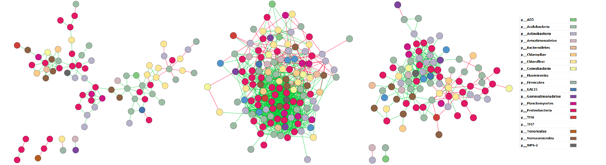
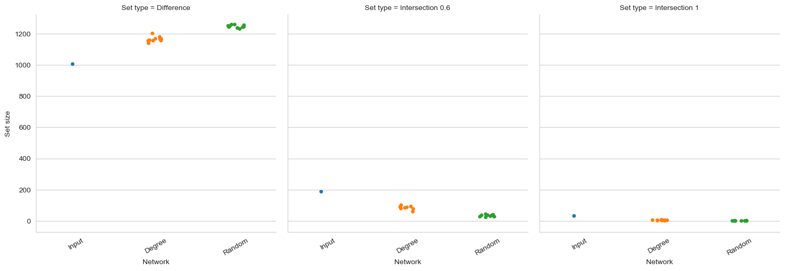
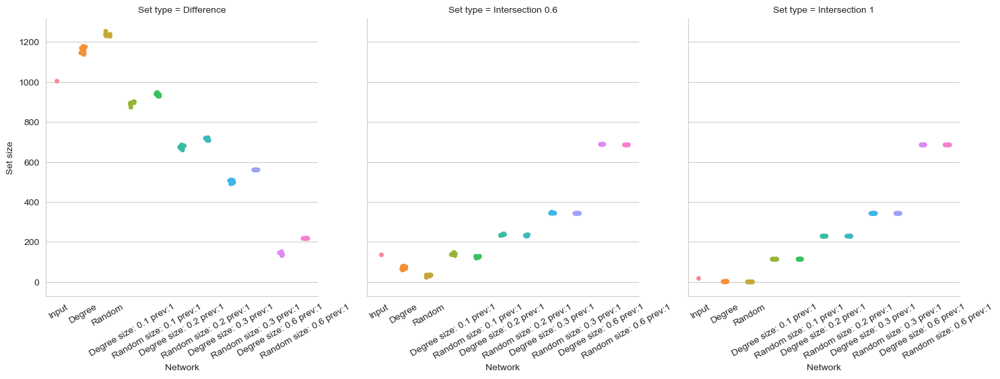
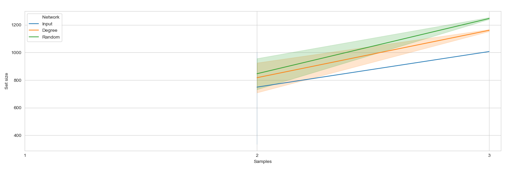
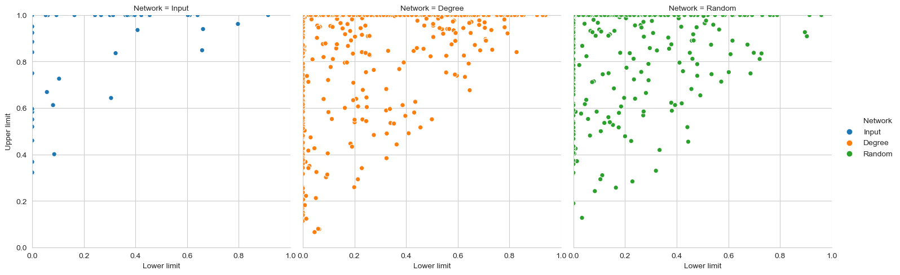
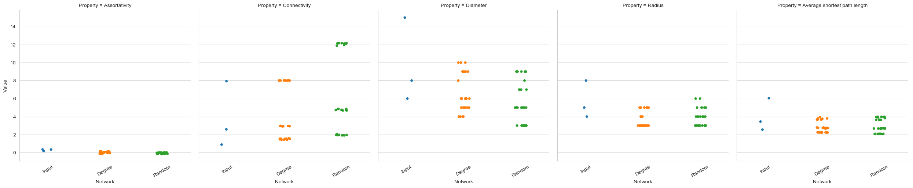

```{r setup, include=FALSE}
knitr::opts_chunk$set(echo = TRUE)
```

## Demo

Three demo networks have been included with the _anuran_ distribution. These networks were constructed with CoNet from a study on the spatial distribution of taxon abundances:

[Meyer, K. M., Memiaghe, H., Korte, L., Kenfack, D., Alonso, A., & Bohannan, B. J. (2018).
Why do microbes exhibit weak biogeographic patterns?. The ISME journal, 12(6), 1404.](https://www.nature.com/articles/s41396-018-0103-3)

In this study, the authors used a spatially explicit nested design to collect soil samples in the Rabi Forest Monitoring Plot in Gabon. This permitted them to construct distance-decay curves and assess whether these were different from such curves found for the trees on the plot. The heatmap below visualizes the Rabi_geodist_matrix file included with this publication, and shows how these samples are ordered. As you can see, the diagonal separates in 3 blocks with lower distances. The samples can be separated into 3 groups, with the in-group distance being much lower than the between-group distance. We used this matrix to separate the samples and construct 3 networks, one for each group. These networks were constructed with CoNet; taxa with a minimum count below 10 or a prevalence below 30% were removed. To handle the large diversity of the sequences, the abundances were merged by taxonomic family. 

```{r geodist, eval=TRUE, out.width="300px"}
geodist <- read.table("Rabi_geodist_matrix.txt", sep='\t', stringsAsFactors = FALSE)
geodist <- sapply(geodist[2:40, 2:40], as.numeric)
heatmap(geodist, Rowv = NA, Colv = NA)
```

Since the samples were collected from a single plot, we do not expect major changes in the community composition, and some associations may be preserved across the three blocks. We can look for such conserved associations with _anuran_. Although many of _anuran_'s features are more applicable to larger numbers of networks, some of these operations can take a lot of time; with this data, you will quickly be able to work through the main features. 

```{r networks, echo=FALSE, out.width="800"}

```

As you can see, even though these networks were generated from identical numbers of samples that were taken from a highly similar environment, there is a lot of variation in the network size. Since many network measures (e.g. betweenness centrality) are closely related to network connectivity, they are not directly comparable. With _anuran_, these differences are taken into account through the generation of null models that closely resemble the original networks. 

To access the demo networks, give _demo_ as the input variable. If you want to upload your own networks, replace _demo_ with the complete filepath to the folder containing your networks. _anuran_ will find all files with .graphml, .gml and .txt (edge list) extensions and try to import these. For exporting all files, _anuran_ will use whatever prefix is specified after the output filepath. 

```{r default, eval=FALSE}
anuran -i demo -o outputpath/demo
```

For a complete explanation of the parameters and their defaults, use the help command. 

```{r help, eval=FALSE}
anuran -h
```

The following parameters will show whether there are more associations shared by 2 or 3 networks than we would expect.

* _-size_ is the size of the intersection; the associations need to be shared by 60% or 100% of the networks.
* _-perm_ is the number of null models generated per original network.
* _-nperm_ is the number of times that the generated null models are subsampled to infer the expected set size.
* _-draw_ is a flag that generates some quick overview figures of the results. 

```{r com1, eval=FALSE}
anuran -i demo -o outputpath/demo -size 0.6 1 -perm 5 -nperm 10 -draw
```

You should find four new files in the filepath you specified: a .csv file with all the set sizes for the networks and the null models, two .graphml files that contain the 0.6 and 1 intersections, and a figure visualizing the data in this .csv file. The figure shows that the difference for the actual networks (labelled 'Input') is smaller than the difference for the null models. Moreover, the two types of null models (Degree and Random) show the effect of the degree distribution on the sets. The degree-preserving null models have a smaller difference than the fully randomized models. 

Additionally, there are more associations shared between two networks than we would expect if the associations were random or only the degree distribution was preserved. 

```{r result1, echo=FALSE, out.width="800"}

```

Adding null models with a synthetic core requires two additional parameters. Since we do not know the true core, the synthetic cores are generated per input network and the sets computed from a single source network. This introduces a large amount of variation in the set sizes for the synthetic cores, but we can still get an idea of the upper limit. The _-cs_ parameter defines the sizes of the synthetic core as the fraction of the total edge number in the networks, while the _-prev_ parameter controls the fraction of networks where the core associations occur. In this case, the core associations are present in 2 out of 3 networks. 

```{r com2, eval=FALSE}
anuran -i demo -o outputpath/demo -size 0.6 1 -perm 10 -nperm 10 -draw -cs 0.1 0.2 0.3 -prev 0.6 
```

Again, the exported image will show the distribution of set sizes. If more associations belong to the core, the difference decreases slightly. The increase in the intersection is difficult to see because there are so many more associations that are unique to each network; however, we do observe that the actual intersection observed falls within the distribution of intersections estimated for the degree-preserving models with a synthetic core. 

```{r result2, echo=FALSE, out.width="800"}

```

If we wanted to see the effect of increasing the number of networks, we could add two parameters: _-sample_ and _-n_. 
The _-sample_ parameter starts the resampling procedure and defines the maximum number of networks to be sampled per network number, while the _-n_ flag is used to determine what numbers of networks should be resampled. In this case, we can only increase the number of networks from 2 to 3. When you have more than 10 networks, the _-n_ parameter becomes important since the resampling procedure can be very time-consuming. For example, with 20 networks, you could set _-n 2 5 10 15 20_ so the networks are only resampled _-sample_ times at each of the numbers specified in _-n_. 

```{r com3, eval=FALSE}
anuran -i demo -o outputpath/demo -size 1 -perm 10 -nperm 10 -sample 5 -n 2 3 -draw
```

The resampling procedure generates a very similar output. Obviously, we only have 2 data points, but there is still an upwards trend visible; adding an extra network increases the total number of unique associations. 

```{r result3, echo=FALSE, out.width="400"}

```

We can also use _anuran_ to find taxa that consistently have high centralities. In this case, we again only have 3 networks, so the estimates for the confidence intervals are not robust. However, we can already find some taxa that consistently have high centralities. To generate the centralities, only the _-c_ flag needs to be included. 

```{r com4, eval=FALSE}
anuran -i demo -o outputpath/demo -size 1 -perm 10 -nperm 10 -c -draw
```

If we look at the lower and upper limits for the 95% confidence interval of the closeness centrality, there are many taxa that have a high upper limit and a low lower limit. This suggests that there was a lot of variation in the closeness centrality ranking for these taxa. However, we can also see that there are only a few taxa in the fully randomized model that have a lower limit above 0.8. That this is larger in the degree-preserving model, suggests that there is a strong correlation between the degree centrality and the closeness centrality. 

```{r result4, echo=FALSE, out.width="800"}

```

Similarly, we can compare the graph properties of the original networks to the null models with the _-net_ parameter. This can take a little more time to run. 

```{r com5, eval=FALSE}
anuran -i demo -o outputpath/demo -size 1 -perm 10 -nperm 10 -net -draw
```

The distribution of the graph properties suggests that there are a lot of differences in topology among the networks. 

```{r result5, echo=FALSE, out.width="800"}

```

While not directly appliccable to this particular set of networks, we can carry out statistics on the properties. Since only 3 networks are available, the statistics are not appropriate on this demo, so _anuran_ will generate a warning. If you want _anuran_ to calculate the statistics but not compute the multiple-testing corrected p-value, use _-stats True_. Otherwise, specify a multiple-testing method after _-stats_, for example _fdr\_bh_. 

```{r com6, eval=FALSE}
anuran -i demo -o outputpath/demo -size 1 -perm 10 -nperm 10 -stats True
```

This generates an additional .csv file that contains comparisons of specific properties to the null models. For example, the set sizes of the original networks are compared to the null models with a Z-score test, while the centrality rankings are compared with Mann-Whitney U tests. Many of these tests (and the centrality confidence interval) require that the data is normally distributed. For the Z-score test, _anuran_ will generate a warning if this is not the case; however, the normality test cannot be carried out on only 3 networks. While the confidence interval for the centralities also assumes that the centrality rankings follow the Student's t distribution, no normality test is used here. Hence, these confidence intervals should be interpreted carefully. 

The table below shows the example output for the statistical analysis on the set sizes. While the Z-test is not appropriate for this data, the p-value approaches zero, suggesting that the set sizes for the demo networks are truly different from those found for the null models. 

```{r result7, echo=FALSE, out.width="800"}
stats <- read.csv('test_set_stats.csv')
knitr::kable(head(stats))
```

In this demo, we only have one folder with networks. _anuran_ can import networks from multiple folders; in this case, the set operations and centrality estimates are computed separately per folder. If you have a nested design, e.g. two studies with soil samples from different locations, you can expand the statistical analysis to take this into account. In this case, the _-compare_ flag compares properties to other folders in addition to null model comparisons. 

```{r com7, eval=FALSE}
anuran -i folder1 folder2 -o outputpath/demo -size 1 -perm 10 -nperm 10 -stats fdr_bh -compare
```

