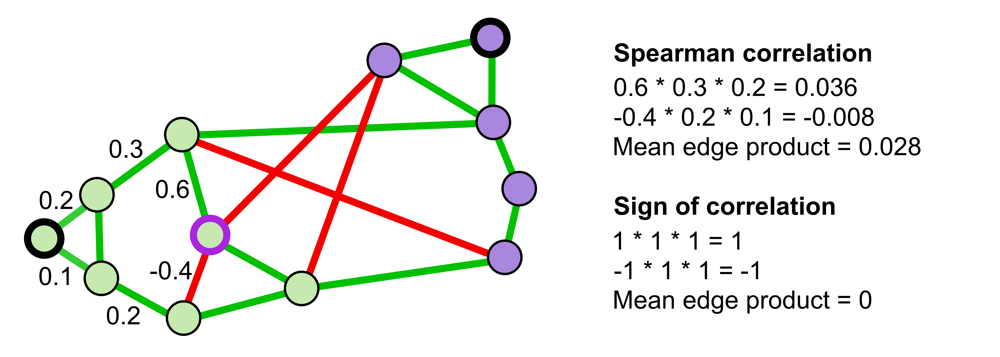
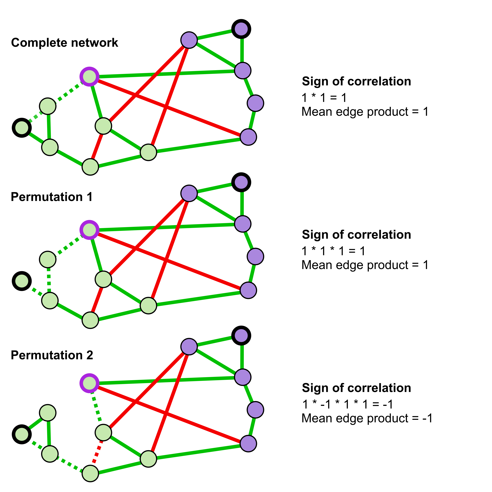

```{r setup, include=FALSE}
knitr::opts_chunk$set(echo = TRUE)
```

## _manta_

For a demo run, a network generated from oral samples of bats has been included.

This data was downloaded from QIITA: https://qiita.ucsd.edu/study/description/11815

Lutz, H. L., Jackson, E. W., Dick, C., Webala, P. W., Babyesiza, W. S., Peterhans, J. C. K., ... & Gilbert, J. A. (2018). __Associations between Afrotropical bats, parasites, and microbial symbionts__. bioRxiv, 340109.

In this dataset, the authors took samples from a number of bats. For the network analysis, only fecal samples were included; samples with fewer than 500 counts were removed and rarefied to even depth, while taxa with a prevalence below 10% were removed as well. A Spearman correlation network was generated from this data for associations with a p-value below 0.05. 

The dataset can be accessed by specifying _demo_ as the input variable. 

```{r default, eval=FALSE}
manta -i demo -o outputpath/demo
```

The network below is a Cytoscape visualization of the network produced by the above command. Nodes were coloured by phylum-level taxonomy, while border colours map to strong (black) or weak (purple) assignments. Node positions were calculated with the force-directed layout algorithm. 

```{r fig1, echo=FALSE, out.width="300px"}
knitr::include_graphics("bats_1.png")
```

Nearly all of the nodes had 'weak' clustering assignments. This is because by default, _manta_ uses the Spearman correlations to determine which nodes have weak assignments. Some of the _manta_ parameters can be adjusted to correct this. Use the _-h_ option to get more information on all parameters. 

```{r help, eval=FALSE}
manta -h
```

The toy model below demonstrates why so many nodes have weak assignments. The edge weights for the two shortest paths from the node with the purple border to its cluster oscillator are shown. Because the Spearman correlations are between 0 and 1, the product of the edge weights tends to be smaller the farther away nodes are from an oscillator. This distance effect is not present when edge weights are converted to 1 and -1. Hence, there are two methods for reducing the number of weak assignments: change the edge scale, or change the edge processing. 

```{r fig2, echo=FALSE, out.width="300px"}

```

The edge scale is set rather high by default (0.8). If this parameter is lowered, fewer assignments will be reported as weak. 
```{r edge, eval=FALSE}
manta -i demo -o outputpath/demo -scale 0.1
```

The resulting graph demonstrates that fewer nodes have a weak assignment. 

```{r fig3, echo=FALSE, out.width="300px"}
knitr::include_graphics("bats_3.png")
```

Alternatively, the edge weights can be converted to 1 and -1. This removes the need to adjust the edge scale setting. 
```{r bin, eval=FALSE}
manta -i demo -o outputpath/demo -b 
```
```{r fig4, echo=FALSE, out.width="300px"}
knitr::include_graphics("bats_4.png")
```

Another setting that can be adjusted is the edge ratio. This is the fraction of edge positions that need to be stable throughout iterations on network subsets for the edges to be considered robust enough to cluster. The illustration below demonstrates how this stability is determined; during each iteration, some edges are deleted. This changes the sign of the shortest path product during some, but not all, iterations. If the sign is stable during a fraction of iterations (the edge ratio), the mean of this position is taken into account for estimation of the scoring matrix. For this example, there are fewer permutations that change the shortest path product to a negative value, so this node will likely still be assigned to the left cluster. 

An edge ratio that is too high can result in _manta_ removing too many edges for estimating the final scoring matrix; an edge ratio that is too low will result in a scoring matrix that mostly separates nodes with high values from all other nodes. 

```{r fig5, echo=FALSE, out.width="300px"}

```

Finally, another way to investigate whether nodes can reliably be assigned to a cluster is the robustness. Unlike the previous strategies, this does not rely on shortest paths, but looks at the Jaccard similarity between two vectors of cluster assignments. Cluster-wise robustness compares the original cluster vectors to the vectors of the permuted clusters with the highest Jaccard similarity. In contrast, node-wise robustness compares the original cluster vector of the node to the permuted cluster vectors that also contain this node. Both measures take some time to compute, as edges in the original network are rewired to preserve the original degree distribution and cluster assignments are then calculated for these rewired networks. The cluster-wise robustness is printed to the command line, while node-wise robustness is added as a node property. 

You can calculate robustness as follows (on the network with edge weights of -1 and 1):
```{r robustness, eval=FALSE}
manta -i demo -o outputpath/demo -cr -b
```

With the width of the robustness confidence interval (CI) mapped to node fill (small width is yellow, large width is blue), the network demonstrates that one of the clusters is much more robust than the other cluster. This can be explained by the larger number of positively-weighted edges inside this cluster; if a few edges are lost, overall cluster structure is retained. Moreover, some nodes in between the clusters have large widths. The CI width indicates that nodes were sometimes assigned to a similar cluster, sometimes to a dissimilar cluster. 

```{r fig6, echo=FALSE, out.width="300px"}
knitr::include_graphics("bats_6.png")
```

In contrast, lowerCI and upperCI give an indication of the similarity of permuted cluster assignments to the original assignment; if upperCI and lowerCI are high, this indicates that permuted clusters were mostly identical. 